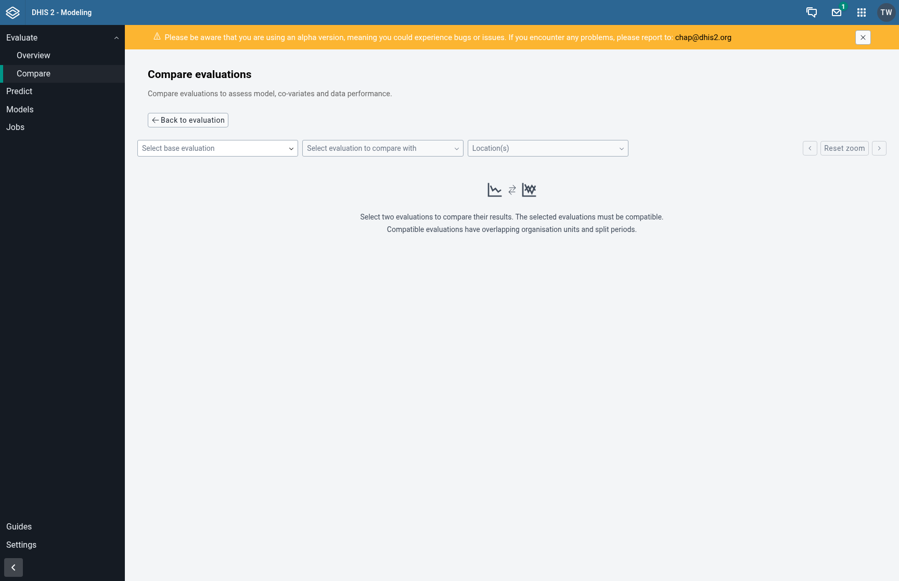
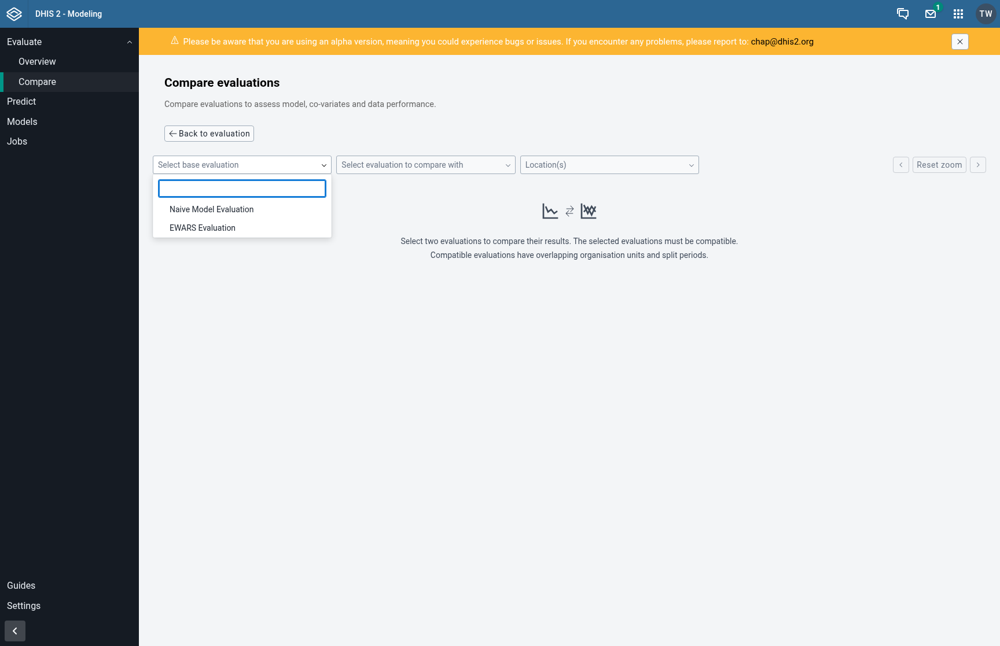
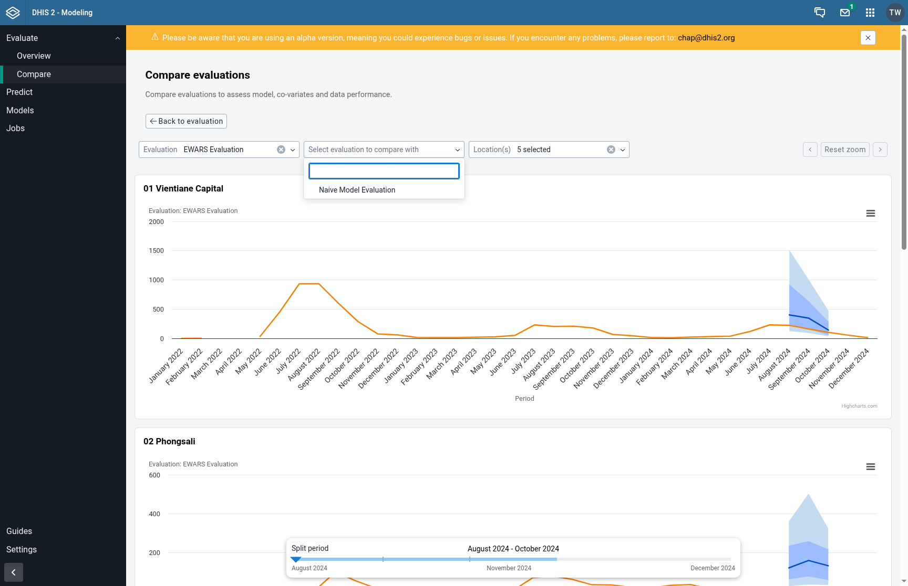
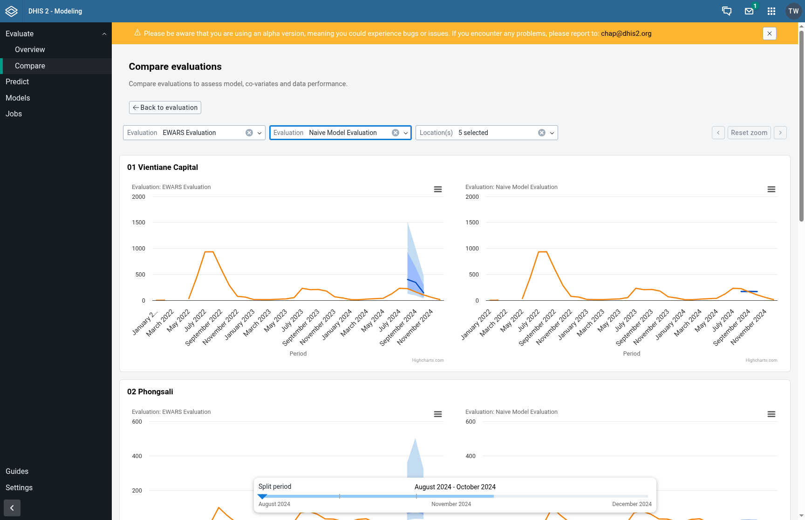

## Comparing Evaluations

The comparison page lets you view two evaluations side by side to determine which model performs better on your data. By comparing prediction intervals, median accuracy, and coverage across organisation units, you can make an informed choice about which model to use for forecasting.

---

### Step 1: Navigate to the Compare Page

There are two ways to reach the comparison page:

- From the **Evaluate** page, click the **Compare** button in the top actions area
- From an evaluation details page, click **Compare with...** in the Quick actions widget — this pre-selects the current evaluation as the base

---

### Step 2: Select the Base Evaluation

Use the first dropdown to select your **base evaluation**. This is the primary evaluation you want to assess. The dropdown lists all completed evaluations.

---

### Step 3: Select the Comparison Evaluation

Use the second dropdown to select a **comparison evaluation**. Only evaluations that are compatible with the base evaluation are shown — they must have overlapping organisation units and split periods.

If no compatible evaluations are available, you may need to create additional evaluations with matching settings.

---

### Step 4: Filter by Organisation Units

Use the **Location(s)** filter to narrow the comparison to specific organisation units. You can select up to 10 locations at a time. By default, all shared organisation units are shown.

This is useful when you want to focus on specific districts or facilities where model accuracy matters most.

---

### Step 5: Read the Comparison Charts

The page displays one chart per organisation unit, showing both evaluations overlaid. Each chart shows:

- **Prediction intervals**: Coloured bands for each model (50% and 80% intervals)
- **Median lines**: The central prediction for each model
- **Actual values**: The observed data points

Look for which model has:
- **Narrower intervals**: Indicates more confident predictions
- **Median closer to actuals**: Indicates better point-estimate accuracy
- **Actuals within bands**: Indicates well-calibrated uncertainty

---

### Step 6: Use the Split-Period Slider

The slider at the bottom lets you change the temporal split point. Moving it shifts where the training data ends and the prediction data begins, so you can compare how both models perform across different time windows.

---

### Step 7: Zoom and Navigate Charts

You can zoom into a specific time range by clicking and dragging on any chart. All charts zoom together (synchronized zoom), so you can compare the same time window across organisation units.

Once zoomed in, use the navigation controls:

- **Shift left / Shift right buttons**: Move the zoomed window one period at a time
- **Keyboard shortcuts**: Press **H** to shift left, **L** to shift right
- **Reset zoom**: Click the reset button to return to the full view

---

### Next Steps

After comparing evaluations, you can:
- [Create a prediction](/guides/creating-a-prediction) using the model that performed best
- [Configure a new model](/guides/configuring-a-model) variant and run another evaluation to fine-tune performance
- Return to the evaluation details page to explore results for an individual evaluation
