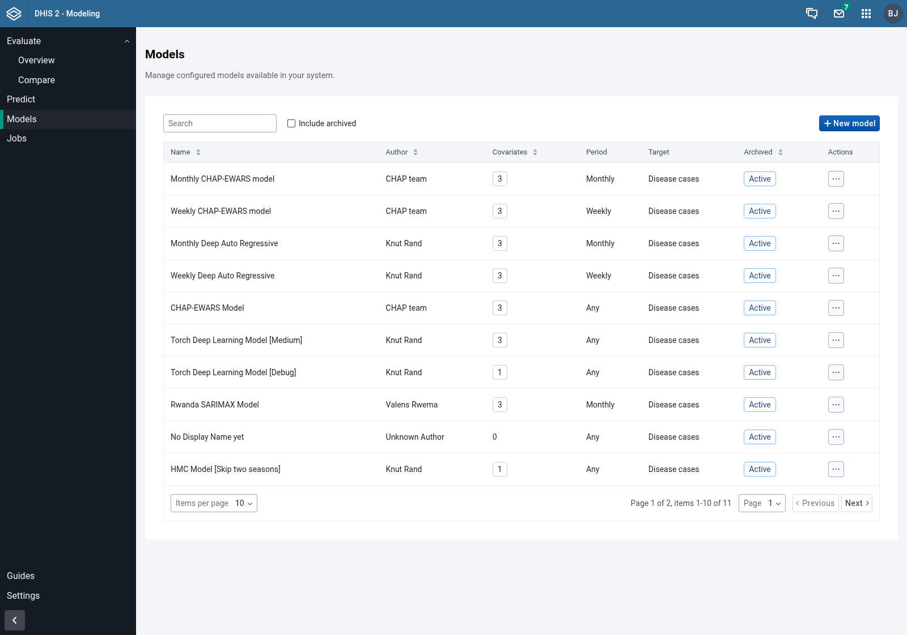
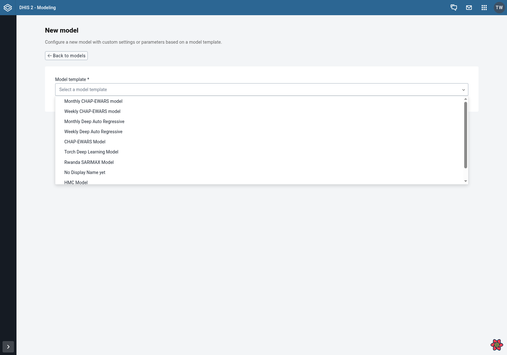
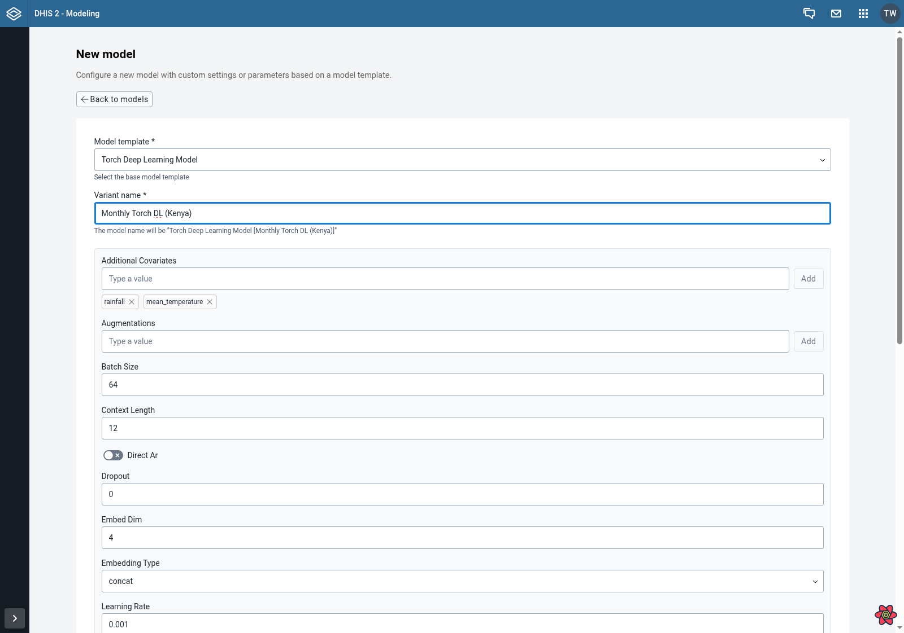
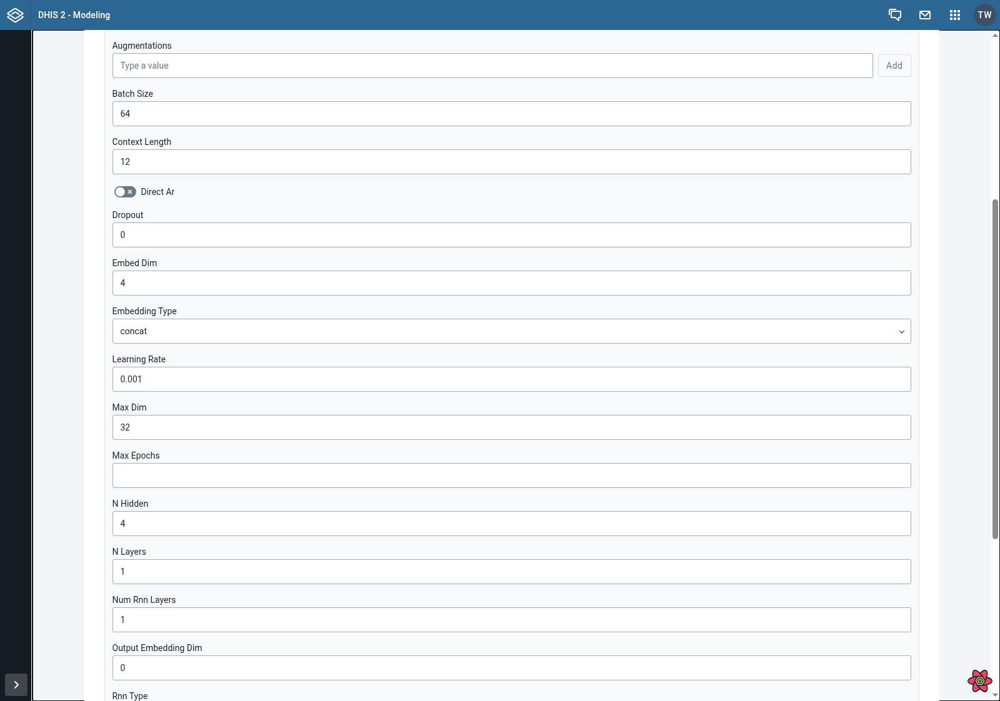
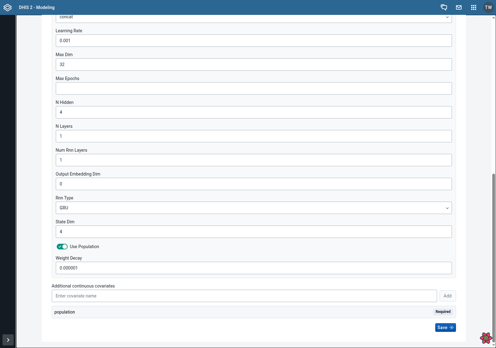

## Configuring a Model

A **model template** is a generic model uploaded to your CHAP instance by a researcher or model developer. To actually use it against your data, you need to create a **configured model** - a named variant of the template with a specific set of options and covariates tailored to your context.

You can create several configured models from the same template (for example, one with default options and one with a longer training window) and then compare them in an evaluation.

---

### Step 1: Navigate to the Models Page

From the main navigation, click on **Models** in the sidebar to access the models page. Here you can see all existing configured models.

Click the **New model** button in the top right to start configuring a new model.

---

### Step 2: Select a Model Template

In the **Model template** dropdown, choose the base template you want to configure. Each template describes the type of model (for example, a deep auto-regressive model or an EWARS-style model) and the covariates it supports.

If the selected template is marked as deprecated, a warning is shown - prefer a non-deprecated template when possible.

---

### Step 3: Enter a Variant Name

Give this configuration a descriptive **Variant name** that distinguishes it from other configurations of the same template. For example: `default`, `long-training`, or `rainfall-only`.

The final model name shown across the app will be `<Template name> [<Variant name>]`, as indicated by the help text below the field.

---

### Step 4: Adjust User Options

If the template exposes configurable options (for example, training horizon, number of samples, or a boolean flag), they appear as form fields below the variant name. Each option comes with a default value from the template - you only need to change the ones you want to customise.

Options that are missing or invalid will block the form from being saved, with inline validation messages.

---

### Step 5: Add Additional Covariates (Optional)

Some templates allow you to include **additional continuous covariates** beyond the ones the template requires by default. If supported, an **Additional covariates** field appears where you can add extra variables (for example, humidity or an additional climate indicator).

If the template does not allow free covariates, this section is hidden.

---

### Step 6: Save the Configured Model

Once all fields are filled in:

1. Review the variant name and options
2. Click **Save** to create the configured model

On success, you are redirected back to the Models page where the new configured model is now listed and can be selected when creating an [evaluation](/guides/creating-an-evaluation) or a [prediction](/guides/creating-a-prediction).

---

### Next Steps

After saving, you can:
- Run an [evaluation](/guides/creating-an-evaluation) to test how well this configuration performs on your historical data
- Create several configurations from the same template and compare them side-by-side
- Use the configured model to generate a [prediction](/guides/creating-a-prediction) once you trust its accuracy
