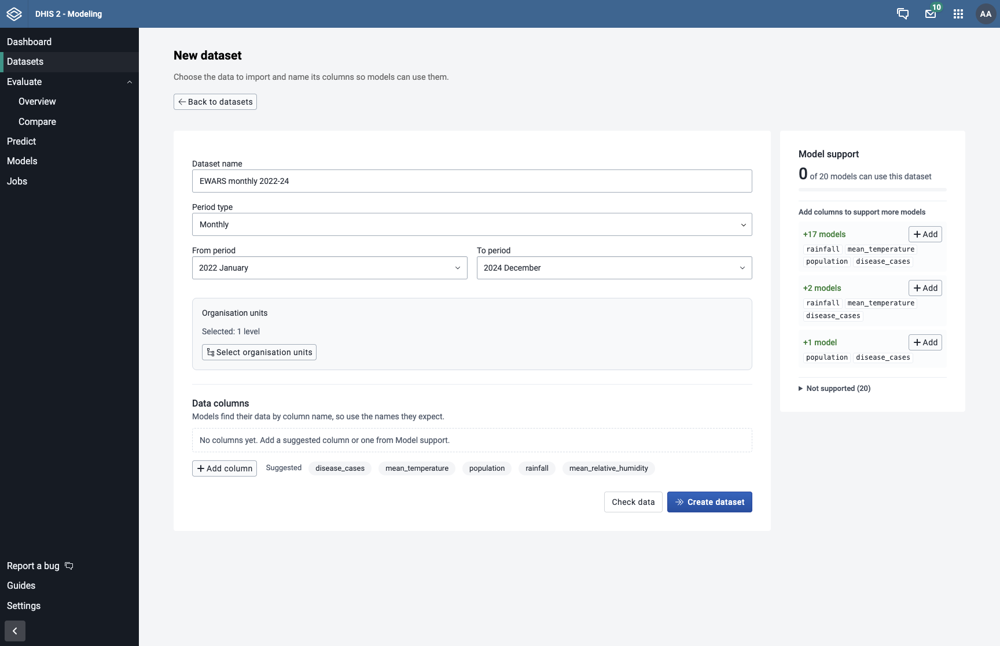

## Creating a Dataset

A **dataset** is a snapshot of DHIS2 data stored in CHAP: a set of named data columns (for example `disease_cases`, `rainfall` and `population`) for chosen locations and periods. Once a dataset is saved, you can run several evaluations against the same data, for example to compare different models, without importing it from DHIS2 each time.

Models find their data by **column name**, so a dataset can only be used by models whose required covariates all match a column in the dataset and whose period type matches the dataset's period type.

---

### Step 1: Navigate to the Datasets Page

Click **Datasets** in the sidebar. The table lists your saved datasets with their period range, number of locations and data columns (covariates).

By default, the filter above the table is set to **Created manually**, so only datasets created on this page are shown. Evaluations and predictions that import data from DHIS2 also save a dataset. To see those, choose **Created by evaluations or predictions**, or clear the filter to show all datasets.

Click **New dataset** to start creating a dataset.

---

### Step 2: Name the Dataset and Choose Periods and Locations

Fill in the basic settings:

- **Dataset name**: A descriptive name, for example "EWARS data 22-24"
- **Period type**: Weekly or Monthly, depending on how your data is aggregated
- **From period** and **To period**: The date range to import (the end cannot be in the future)
- **Organisation units**: Click **Select organisation units** and choose the locations to include

---

### Step 3: Add Data Columns

Each data column pairs a **Column name** with a **DHIS2 data item** (a data element, indicator or program indicator). Most models need a `disease_cases` column for the outcome you want to forecast.

- Click one of the **Suggested** names below the columns to add a column with that name, or click **Add column** and type a name yourself. Suggestions come from the column names the configured models read.
- Search for and select the DHIS2 data item to import into that column. If an earlier dataset used the same column name, the data item it used is suggested first.
- Click the delete button next to a column to remove it.

Under each column name, a hint shows how many models read a column with that name. If no model reads it, check the spelling or pick a suggested name.

---

### Step 4: Check Model Support

The **Model support** panel on the right updates as you edit the columns and period type. It shows:

- How many of the configured models can use the dataset
- **Add columns to support more models**: Column sets that would make more models compatible. Click **Add** to add those columns to the form
- **Supported** and **Not supported** lists: Each unsupported model shows the columns it still needs, or the period type it expects

Use this panel to make sure the models you want to evaluate can use the dataset before you import it.

---

### Step 5: Check the Data and Create the Dataset

1. Optionally click **Check data** to preview the import without saving anything. A summary shows which locations have data, and which would be left out because of missing data or missing shapes.
2. Click **Create dataset** to start the import.

The import runs as a background job, and you can follow it on the **Jobs** page. When it finishes, the new dataset appears on the Datasets page. If some locations were left out, a notice lets you view the details.

---

### Next Steps

After the dataset is created, you can:
- Click **New evaluation** in the dataset's row to [evaluate a model](/guides/creating-an-evaluation) on it
- Run several evaluations against the same dataset to compare models on identical data
- [Configure a model](/guides/configuring-a-model) that fits the dataset's columns
