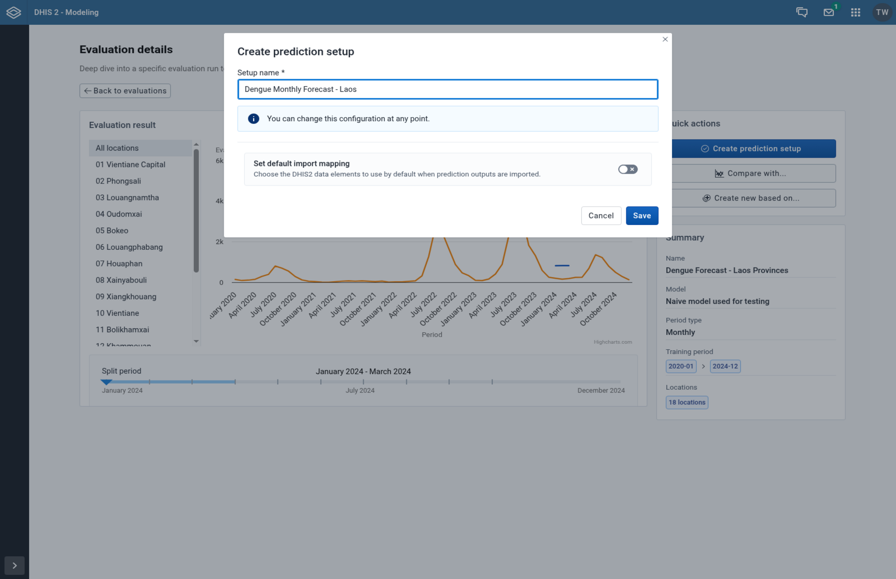
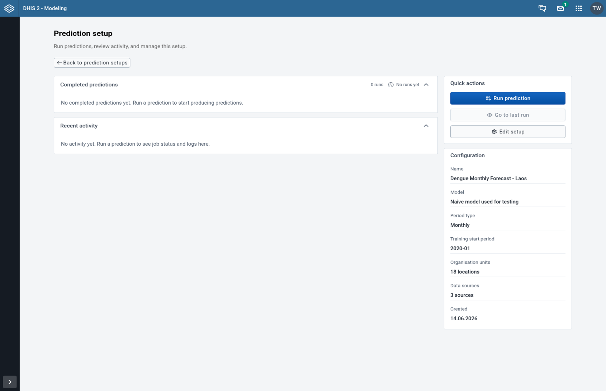
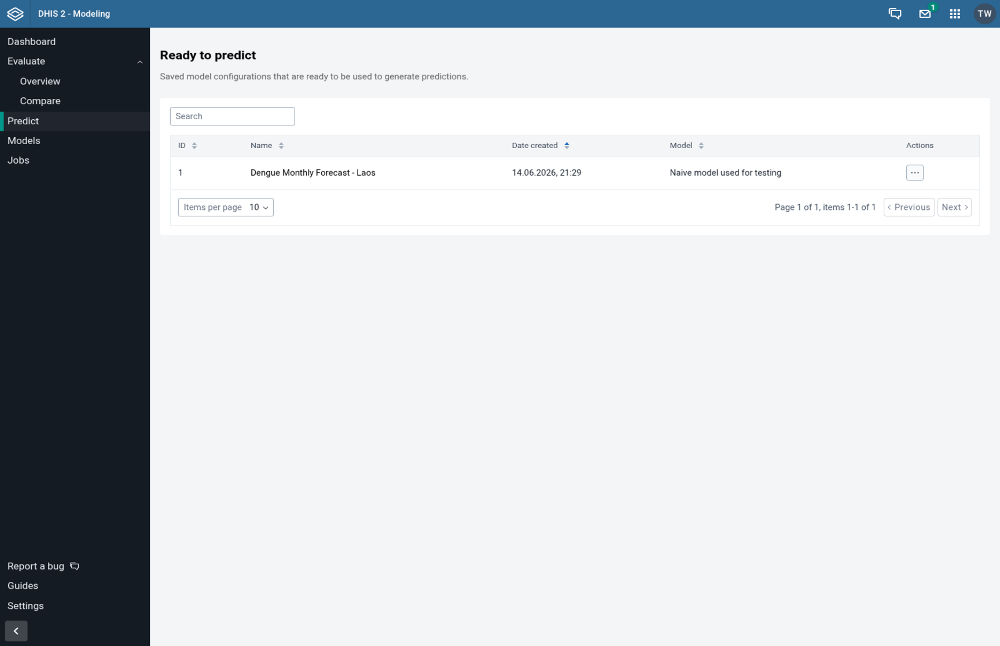
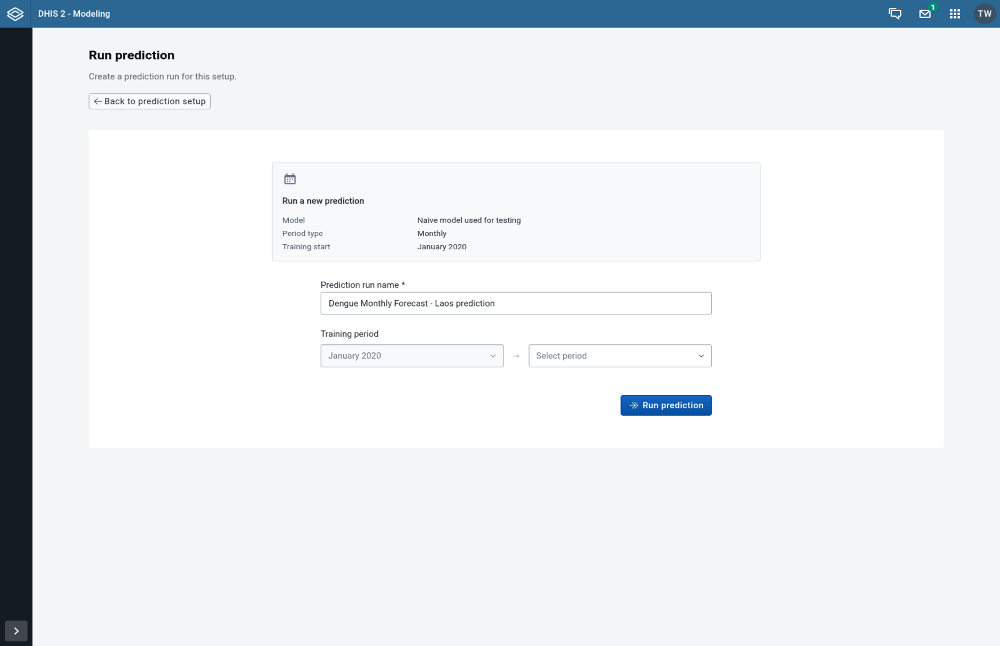

## Creating a Prediction

A prediction uses a trained model to forecast future disease cases based on your current data. Unlike an evaluation (which tests model accuracy on historical data), a prediction generates forecasts that can be imported into DHIS2 to support decision-making in the field.

Predictions in CHAP follow a two-phase workflow:

1. **Create a prediction setup** - a saved configuration that captures the model, organisation units, data mappings, and period type from a completed evaluation.
2. **Run predictions** from that setup - a lightweight step where you name the run and select the last training period.

Before creating a prediction, you must first run an [evaluation](/guides/creating-an-evaluation) to validate that your chosen model performs well on your data.

---

## Phase 1: Create a Prediction Setup

A prediction setup is created from a completed evaluation. It inherits the model, organisation units, training start period, and data source mappings, so you don't need to reconfigure them each time you want to predict.

### Step 1: Open a Completed Evaluation

Navigate to **Evaluate** in the sidebar and click on a completed evaluation to open its details page.

In the **Quick actions** widget on the right, you will see a **Create prediction setup** button (if no setup exists yet for this evaluation).

---

### Step 2: Configure the Prediction Setup

Clicking **Create prediction setup** opens a modal with the following fields:

- **Setup name** (required): A descriptive name for this prediction configuration (e.g., "Malaria Weekly Forecast" or "Dengue Prediction - Coast Region").
- **Import mapping** (optional): Toggle this on to pre-configure which DHIS2 data elements the prediction quantiles (high, mid-high, median, mid-low, low) and outbreak indicator should be imported into. This can also be configured later.

Click **Save** to create the prediction setup.

---

### Step 3: View the Prediction Setup Dashboard

After creating the setup, you are redirected to the **prediction setup dashboard**. This page shows:

- **Prediction runs**: A list of all prediction runs for this setup
- **Recent activity**: Job history and status
- **Quick actions**: Buttons to run a new prediction, view the last run, or edit the setup
- **Configuration**: Summary of the inherited settings (model, period type, training start, organisation units, data sources)

You can also reach this page at any time by clicking **Predict** in the sidebar and selecting a setup from the table.

---

## Phase 2: Run a Prediction

Once a prediction setup exists, running predictions is a streamlined process.

### Step 4: Navigate to the Predict Page

Click **Predict** in the sidebar to see the **Ready to predict** page. This table lists all saved prediction setups with their name, creation date, and model.

Click on a prediction setup to open its dashboard.

---

### Step 5: Start a New Prediction Run

From the prediction setup dashboard, click **Run prediction** in the Quick actions widget. This opens the prediction run form.

The form shows a summary of the inherited configuration (model, period type, and training start) and provides two fields:

- **Prediction run name** (required): A name for this specific run (e.g., "May 2025 forecast"). A default name based on the setup name is pre-filled.
- **Training period**: The training start is fixed from the setup. Select the **last training period** - this is the end of the data window the model uses for training. The model will forecast from this point forward.

---

### Step 6: Submit the Prediction

Click **Run prediction** to submit. The prediction is queued as a background job. You are redirected back to the prediction setup dashboard where you can monitor its progress in the Recent activity widget.

---

### Next Steps

After the prediction completes, you can:
- View forecast results and visualizations by clicking on the run in the Prediction runs widget
- Import the forecasted values into DHIS2 for use in dashboards and reports
- Run additional predictions with updated training periods as new data becomes available
- Edit the prediction setup (name and import mapping) via the **Edit setup** button in Quick actions
