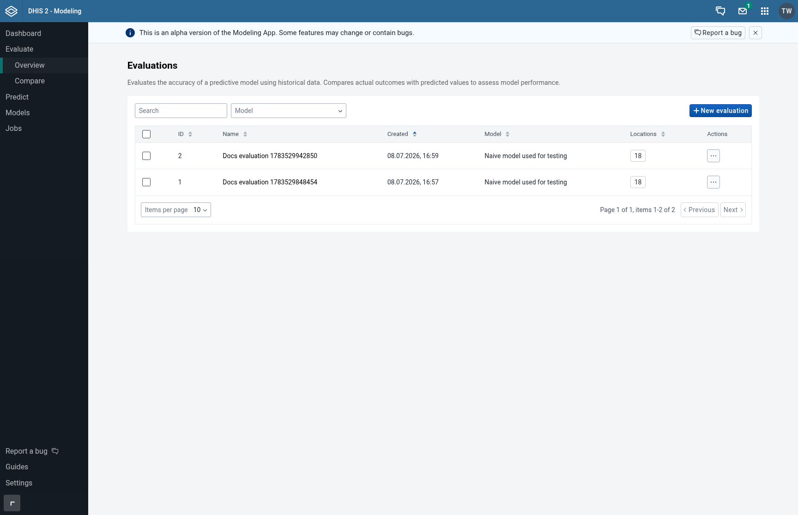
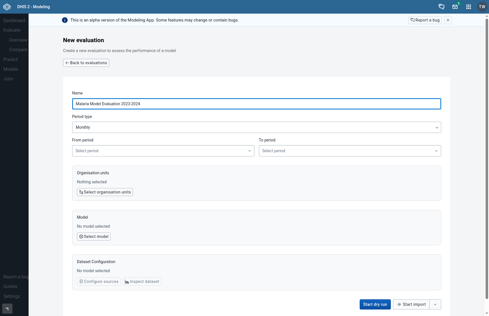
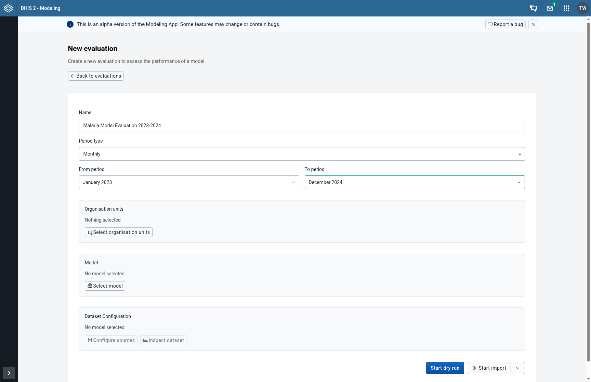
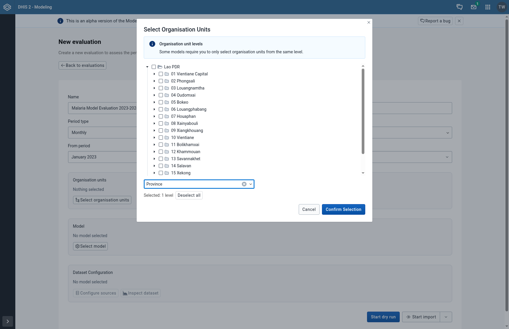
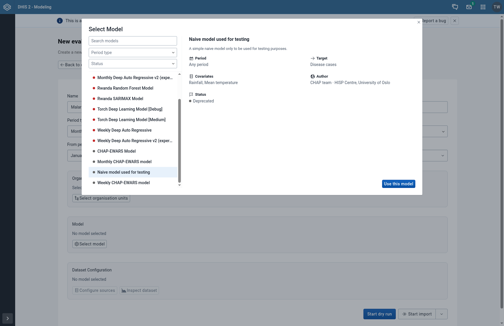
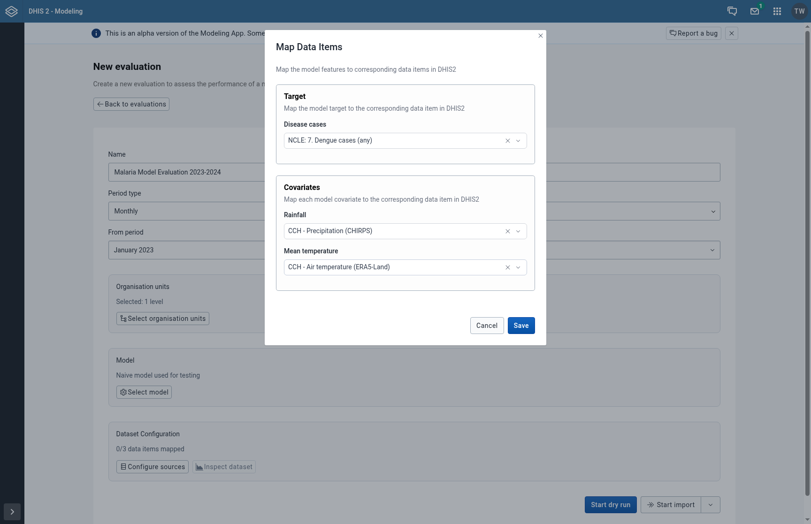
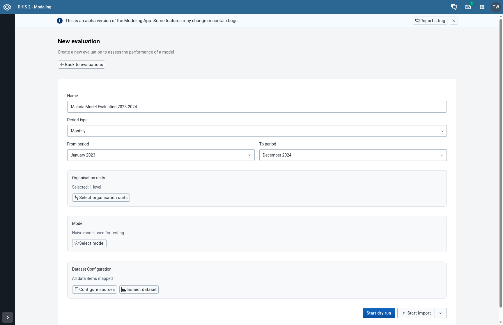

## Creating an Evaluation

An evaluation tests how accurately a predictive model performs using your historical data. It compares actual outcomes with predicted values across specified time periods and locations, giving you confidence in the model before using it for forecasting.

There are two ways to create an evaluation, shown as tabs on the **New evaluation** page:

- **Use saved dataset**: Evaluate a model on a dataset you have already imported. This is the quickest option, and it lets you compare several models on exactly the same data. See [Creating a dataset](/guides/creating-a-dataset).
- **Import from DHIS2**: Pick the periods, locations, model and data items for this evaluation only. The data is imported from DHIS2 when the evaluation starts.

---

### Step 1: Navigate to the Evaluations Page

From the main navigation, click on **Evaluate** in the sidebar to access the evaluations page. Here you can see all existing evaluations and create new ones.

Click the **New evaluation** button to start creating a new evaluation. The page opens on the **Use saved dataset** tab.

---

## Option A: Use a Saved Dataset

### Step 2: Choose a Dataset

The **Use saved dataset** tab is selected by default. You can also go straight here from the **Datasets** page by clicking **New evaluation** in a dataset's row, which pre-selects that dataset.

Enter a **Name** for the evaluation, then select a **Dataset**. A filter next to the dataset list works like the one on the Datasets page: by default only datasets created on the Datasets page are listed.

If you have no saved datasets yet, the tab offers to create one or to import from DHIS2 instead.

---

### Step 3: Choose a Model and Start the Evaluation

The **Model** dropdown only lists configured models that can use the selected dataset: the dataset must have a column for every covariate the model requires, and the same period type. If no model matches, a notice is shown instead.

Select a model and click **Start evaluation**. The evaluation is queued as a background job and you are taken to the **Jobs** page, where you can monitor its progress.

---

## Option B: Import from DHIS2

### Step 2: Enter an Evaluation Name

Click the **Import from DHIS2** tab.

Give your evaluation a descriptive name that helps you identify it later. For example: "Malaria Model Evaluation 2023-2024" or "Weekly Cholera Backtest".

---

### Step 3: Configure the Time Period

Select the time period settings for your evaluation:

- **Period Type**: Choose between Weekly or Monthly depending on how your data is aggregated
- **From period**: The start of your evaluation period
- **To period**: The end of your evaluation period (cannot be in the future)

The evaluation will use historical data within this range to test the model's predictions.

---

### Step 4: Select Organization Units

Click on the location selector to open the organization unit tree. Select one or more locations where you want to run the evaluation.

You can select individual facilities, districts, or higher-level units depending on your needs. At least one organization unit must be selected.

---

### Step 5: Select a Model

Click on the model selector to choose which predictive model to evaluate. The modal displays available models with their descriptions.

Select the model you want to test against your data. Only one model can be selected per evaluation.

---

### Step 6: Configure Data Mapping

After selecting a model, you need to map the model's variables to your DHIS2 data sources:

1. Click **Configure sources** to open the data mapping modal
2. **Target Variable**: Map the outcome variable (e.g., disease cases) to a data element, indicator, or program indicator in DHIS2
3. **Covariates**: Map each covariate the model requires (e.g., climate data, population) to corresponding data sources

You can click **Inspect dataset** to preview the actual data that will be used before submitting.

---

### Step 7: Review and Submit

Once all fields are configured:

1. Review your selections in the form summary
2. Optionally click **Start dry run** to validate your configuration and check for missing data
3. Click **Start import** to submit the evaluation

The evaluation will be queued as a background job. You can monitor its progress on the Jobs page.

---

### Next Steps

After the evaluation completes, you can:
- [View detailed results](/guides/viewing-evaluation-results) and metrics on the evaluation details page
- [Compare evaluations](/guides/comparing-evaluations) to find the best model configuration
- [Create a prediction](/guides/creating-a-prediction) with a validated model
