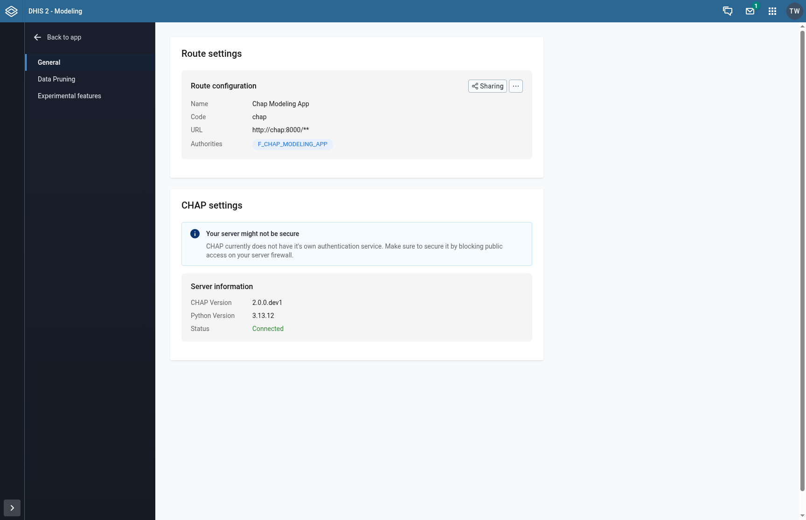
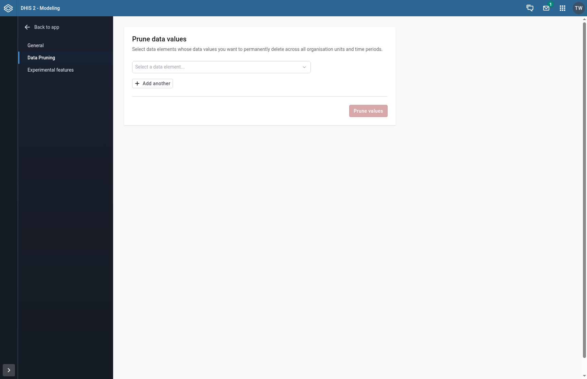
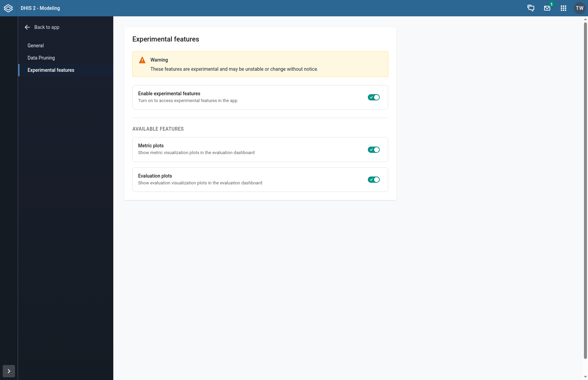

## Settings

The Settings area lets you configure how the Modeling App connects to your CHAP backend, manage data, and enable experimental features. Open it by clicking **Settings** in the sidebar navigation.

Settings is divided into several sections, each accessible from the left-hand menu: **General** (route and CHAP server), **Data pruning**, and **Experimental features**.

---

### Step 1: Open the Settings Page

Click **Settings** in the sidebar to open the settings area. The General settings section is shown by default.

---

### Step 2: Configure the DHIS2 Route

The **Route settings** card manages the DHIS2 route that proxies requests to your CHAP backend server.

If no route exists yet, click **Add route** and enter the URL of your CHAP backend (for example, `https://chap.example.org`). If a route already exists, you will see its name, code, URL, and any assigned authorities.

To modify or delete an existing route, use the action buttons next to the route configuration header.

> **Required permissions**: You need either the `F_ROUTE_PRIVATE_ADD` or `F_ROUTE_PUBLIC_ADD` authority in DHIS2 to create or edit routes. If you do not have these, contact your system administrator.

---

### Step 3: Review Public Access and Timeout Warnings

After a route is configured, two warnings may appear:

- **Public access warning**: Shown when your route has public read/write access. This means any DHIS2 user can reach the CHAP backend, which could expose sensitive data. To restrict access, click the **Sharing** button and remove access for "All users".

- **Low response timeout warning**: Shown when the route's timeout is set below 10 seconds. Long-running model operations (evaluations, predictions) may fail with a low timeout. Click the **Increase to 30 seconds** button to apply the recommended setting.

---

### Step 4: Check the CHAP Server Status

Below the route settings, the **CHAP settings** card shows information about the connected CHAP backend:

- **CHAP Version**: The version of chap-core running on the server
- **Python Version**: The Python version on the server
- **Status**: A green "Connected" label confirms the app can reach the backend

If the connection fails, an error message is shown suggesting you verify your route configuration.

---

### Step 5: Prune Data Values

Click **Data pruning** in the settings sidebar to access the data pruning tool. This is a **superuser-only** feature for permanently deleting data values generated by CHAP.

1. Click the data element selector and choose a data element whose values you want to remove
2. Click **Add another** to add more data elements (up to 10)
3. Click **Prune values** to open the confirmation modal
4. Review the list of data elements to be pruned and confirm

> **Warning**: Pruning permanently deletes all data values for the selected data elements across all organisation units and time periods. This action cannot be undone.

If you do not have superuser authority, a message will inform you that you lack the required permissions.

---

### Step 6: Enable Experimental Features

Click **Experimental features** in the settings sidebar. Toggle the main **Enable experimental features** switch to turn on access to experimental functionality.

Once enabled, you can toggle individual features:

- **Metric plots**: Adds a metric visualization widget to the evaluation details page, showing statistical accuracy indicators such as CRPS
- **Evaluation plots**: Adds a custom evaluation visualization widget to the evaluation details page with alternative chart types

These features are experimental and may change or be removed in future releases.

---

### Next Steps

After configuring your settings, you can:
- [Configure a model](/guides/configuring-a-model) to set up a model for evaluation or prediction
- [Create an evaluation](/guides/creating-an-evaluation) to test a model against your historical data
- [Create a prediction](/guides/creating-a-prediction) to generate forecasts for future periods
