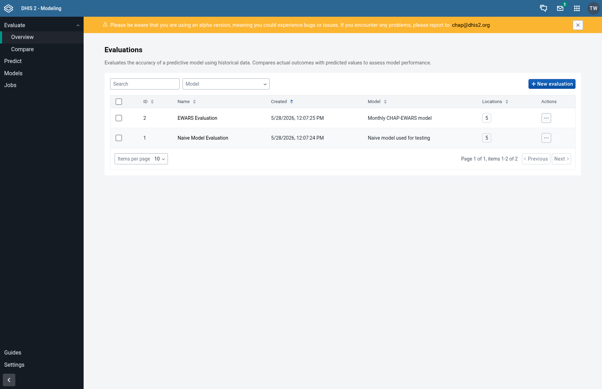
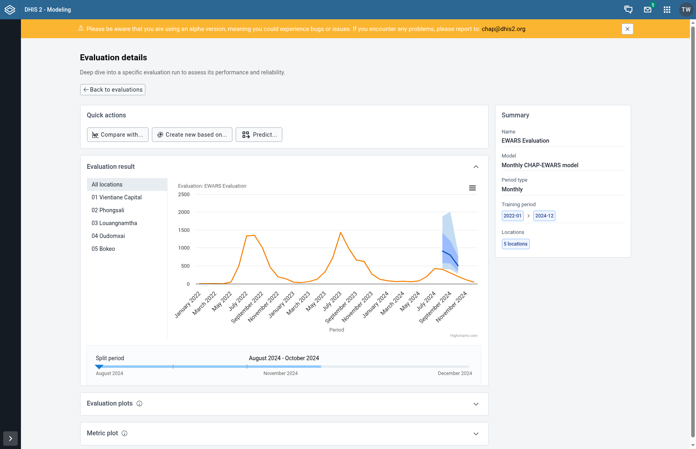
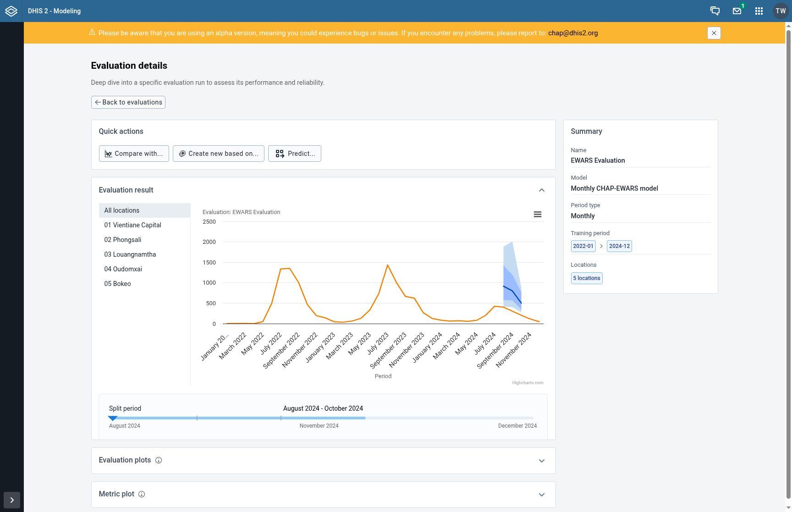

## Viewing Evaluation Results

Once an evaluation has completed, the evaluation details page shows you how well the model performed against your historical data. This page helps you determine whether the model's predictions were accurate enough to trust for forecasting.

---

### Step 1: Open the Evaluation Details Page

From the **Evaluate** page, click on the name of a completed evaluation to open its details page. You will see a back button at the top to return to the evaluations list.

---

### Step 2: Review the Summary Widget

On the right side of the page, the **Summary** widget shows key information about the evaluation:

- **Name**: The evaluation name you entered when creating it
- **Model**: Which configured model was used
- **Period type**: Whether the evaluation uses weekly or monthly data
- **Training period**: The start and end periods used to train the model
- **Locations**: The number of organisation units included in the evaluation

Use this to confirm you are looking at the correct evaluation.

---

### Step 3: Interpret the Evaluation Result Chart

The main chart shows the model's predictions overlaid on actual data. Look for:

- **Orange line**: Actual observed values from your DHIS2 data
- **Blue bands**: Prediction intervals (50% inner band and 80% outer band)
- **Dark blue line**: The model's median prediction

A good model will have its median line close to the actual values, and the actual values should mostly fall within the prediction bands.

Use the **organisation unit menu** on the left to switch between locations and see how the model performed in different areas. Select "All locations" to see an aggregated view.

---

### Step 4: Adjust the Split Period

The **split-period slider** below the chart lets you choose which prediction window is shown. Moving the slider changes the selected split-period range and updates the chart to show how well the model predicted at different time points.

This helps you understand whether the model's accuracy is consistent across different time periods or if it degrades at certain points.

---

### Step 5: Use Quick Actions

The **Quick actions** widget provides shortcuts to common next steps:

- **Compare with...**: Opens the comparison page with this evaluation pre-selected as the base, so you can compare it against another evaluation
- **Create new based on...**: Creates a copy of this evaluation with pre-filled settings, useful for running a similar evaluation with small changes
- **Predict...**: Creates a prediction using the same model and data mapping from this evaluation

---

### Next Steps

After reviewing the results, you can:
- [Compare evaluations](/guides/comparing-evaluations) to see how this model stacks up against alternatives
- [Create a prediction](/guides/creating-a-prediction) if the model performs well enough for forecasting
- Run another evaluation with different settings to improve performance
